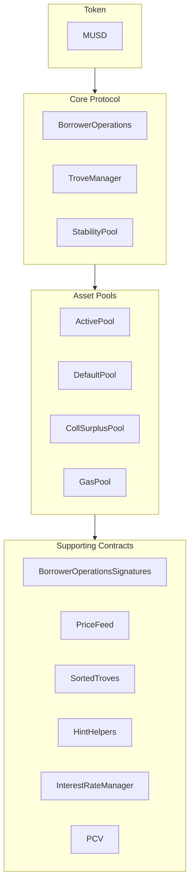

# Mezo USD

mUSD is a stablecoin that is minted by creating a loan against the borrowers crytpo assets, this is known as a Collateralised Debt Position (CDP).

mUSD is based on [Threshold USD](https://github.com/Threshold-USD/dev) which is a fork of [Liquity](https://github.com/liquity/dev) for the [Mezo Network](https://mezo.org).

## Architectural Overview

The protocol allows Bitcoin holders to mint mUSD (mezo USD stablecoins) by using their BTC as collateral. This means users can access USD-denominated liquidity while keeping their Bitcoin investment intact.

The primary components are how the...

- BTC is **custodied**.
- mUSD token maintains its **1 mUSD = $1 price peg**.
- system earns **fees**.

### Custody

A user opens up a position by calling `BorrowerOperations.openTrove`, providing BTC, and requesting mUSD. The BTC is routed to the `ActivePool`, where it stays until a user either...

- withdraws (via `BorrowerOperations.withdrawColl`)
- pays off their debt (via `BorrowerOperations.closeTrove`)
- is redeemed against (via `TroveManager.redeemCollateral`)
- gets liquidated (via `TroveManager.liquidate`)

Liquidated positions are either paid for by the `StabilityPool`, in which case the BTC is transferred there, or the debt and collateral are absorbed and redistributed to other users, in which case the BTC is transferred to the `DefaultPool`.

### Maintaining the Peg

We maintain the **price floor of $1** through arbitrage, an external USD <-> BTC price oracle, and the ability to redeem mUSD for BTC $1 for $1 (via `TroveManager.redeemCollateral`). Imagine that mUSD was trading for $0.80 on an exchange and that bitcoin is selling for 1 BTC = $100k. A arbitrageur with $800 could:

1. Trade $800 for 1000 mUSD
1. Redeem 1000 mUSD for 0.01 BTC ($1000 worth of BTC)
1. Sell 0.01 BTC for $1000

The arbitrageur started with $800 and ended with $1000 (ignoring fees). This trade _buys_ mUSD and _burns_ it (for the backing BTC), causing upwards price pressure. This trade continues to be effective until the price resets to $1.

We maintain a **price ceiling of $1.10** via the minimum 110% collateralization ratio. Imagine that mUSD for trading for $1.20 on an exchange, and that bitcoin is selling for 1 BTC = $100k. An arbitrageur with $100k could:

1. Buy 1 BTC (worth $100k)
1. Open up a trove with 1 BTC as collateral, and the maximum 90,909 mUSD as debt.
1. Sell 90,909 mUSD for $109,091.

The arbitrageur started with $100k and ended with $109k (ignoring fees). This trade _sells_ and _mints_ mUSD, causing downward price pressure. This trade continues to be effective until the price reaches $1.10.

### Fees

The protocol collects fees in four places:

- An origination fee of 0.5% (governable), which is added as debt to a trove but minted to governance.
- A redemption fee of 0.5% (governable), which is taken whenever a user redeems mUSD for BTC. For example, at 0.5%, whenever $100 of mUSD is redeemed, the user receives $99.50 worth of BTC and the protocol receives $0.50 worth of BTC.
- A refinancing fee, which operates like the origination fee.
- [Simple](https://www.investopedia.com/terms/s/simple_interest.asp), [fixed](https://www.creditkarma.com/credit/i/fixed-interest-rate) interest on the principal of the loan.

There is a global, governable interest rate that all new troves use when they are opened but after that, changes to the global interest rate do not impact any existing troves. At any time, a user is allowed to refinance to the global rate.

Simple interest is non-compounding. For example, if a user owes a principal of $10,000 at a 3% annual interest rate, then after a year, they will owe $300 in interest, and after another year (without paying), $600 in interest, and so on.

## Core Ideas

### Immutability

To give borrowers certainty the deployed contracts are immutable. However at some point in the future if the price feeds no longer work the price feed logic will fail.

- Sets of immutable contracts are deployed together for different versions or collaterals.
- The mintlist in the mUSD Token contract is used to sunset contracts if a new version is deployed by preventing any new debt positions from being opened. However the contracts will continue to function.
- There is a governance delay to make changes to the mint list.
- There is a governance delay to deploy new sets of contracts.

The tradeoffs between immutability and upgradability are explored [here](https://medium.com/@ben_longstaff/threshold-usd-token-design-trade-offs-2926087d31c4).

The three main contracts - `BorrowerOperations.sol`, `TroveManager.sol` and `StabilityPool.sol` - hold the user-facing public functions, and contain most of the internal system logic. Together they control Trove state updates and movements of collateral and mUSD tokens around the system.

### Liquidations

Whenever a trove becomes under-collateralized (sub 110% BTC value to debt), it is eligible for liquidation. We have two ways to liquidate troves: with the Stability pool (default), and with redistribution (fallback).

When a user (or bot) calls `TroveManager.liquidate` on a trove with sub-110% collateral, that user is rewarded with a $200 mUSD gas compensation as well as 0.5% of the trove's collateral. Then, the Stability pool burns mUSD to cover all of the trove's debt and siezes the remaining 99.5% of the trove's collateral.

If the Stability Pool has insufficient funds to cover all of the trove debt, we redistribute both the debt and collateral. All of the debt and collateral is sent to the Default Pool, where a user's ownership of the default pool is equal to their proprotional ownership of all deposited collateral.

### Stability Pool

The Stability Pool provides a mechanism to socialize liquidations. Users deposit mUSD into the pool, and the stability pool has first priority to provide mUSD to liquidate troves and seize collateral.

In effect, the Stability Pool is buying BTC at a discount from liquidated troves. If a trove has $10000 in debt backed by $11000 worth of BTC, then when that trove is liquidated, the pool loses $10000 mUSD and gains $10,945 worth of BTC. In effect, they were able to buy $10945 worth of BTC for $10000 which is a ~9% discount.

Users own shares of the pool, and when they exit the pool, they withdraw both their mUSD and their share of seized BTC.

For example, say that the pool currently has $20000 mUSD. A user deposits $5000 mUSD. They would own 5000 shares out of 25000 shares. Later, the pool burns $3000 mUSD and seizes $3270 worth of BTC and the user decides to exit. The pool still has 25000 shares, but now has $22000 mUSD and $3270 BTC. The user withdraws `5000 / 25000 * $22000 = $4400` mUSD and `5000 / 25000 * $3270 = $654` worth of BTC.

The Stability pool is seeded by a bootstrap loan given to governance. $100m mUSD is minted against future fees, and the `PCV` contract assumes $100m of debt. That $100m mUSD is deposited directly into the Stability Pool. 50% of all [protocol fees](#fees) are burned to incrementally pay off this bootstrap loan.

### Redemptions

A user may call `TroveManager.redeemCollateral` to burn mUSD to obtain BTC, $1 for $1 worth (minus the redemption fee). This is the main mechanism [maintaining the peg](#maintaining-the-peg).

The trove with the lowest collateral ratio (but above the 110% liquidation threshold) has an equivalent amount of debt canceled, and then their BTC is trasferred to the redeeming user. This has a net effect of _raising_ their collateral ratio.

For example, say that...

- Alice has $1000 debt backed by $1300 collateral (130% ratio)
- Bob has $1000 debt backed by $2000 collatearl (200% ratio)

Carol redeems $50. Alice's debt and collateral are reduced by $50. Carol receives `$50 * .995 = $49.75` worth of BTC, and the protocol receives `$50 * .005 = $0.25` as a redemption fee.

Alice now has $950 debt backed by $1250 collateral (132% ratio).

Someone's full debt can be cancelled in this way. For example, if Carol redeemed $1000 instead of $50, then Alice's debt would be fully paid, and she would be left with $300 worth of collateral. The remaining collateral is sent to the `CollSurplusPool`. Alice can collect it by calling `BorrowerOperations.claimCollateral`.

## Supporting Ideas

### Gas Compensation

When a user opens up a trove, an extra flat $200 mUSD is minted for gas compensation, sent to the `GasPool`, and added to the borrower's debt. This debt is included when calculating the user's collateral ratio.

When a trove is liquidated, the whole debt (including the $200 gas compensation) is paid. The initiator of the liquidation is sent the $200 gas compensation, to offset any gas they might pay to call the liquidation function, especially in times of high network traffic.

In other situations (redemption, closing a trove, repaying debt), the last $200 of debt of a trove is paid by the Gas Pool.

For example, say that Alice wants to mint $2000 mUSD with $3000 of BTC as collateral. Alice will receive $2000, $200 will be sent to the Gas Pool, and a origination fee of $10 (0.5%) is sent to the protocol.

Alice's total debt, for liquidations or calculating collateral ratios, is $2210.

If Bob liquidates Alice, The stability pool burns $2210 and the Gas Pool sends Bob $200.

If Bob fully redeems Alice, only $2010 can be redeemed; the Gas Pool burns the remaining $200 to close Alice's trove.

If Alice closes her own trove, she only needs to pay back $2010; the Gas Pool will burn the remaining $200 to pay off all of the debt.

### Recovery Mode

If the Total Collateral Ratio (TCR), the value of all of the collateral divided by the total debt, of the system ever falls below the Critical Collateral Ratio (CCR) of 150%, we enter into Recovery Mode.

In Recovery Mode...

- We require that newly opened troves have at least 150% (the CCR) collateral, rather than the normal 110%.
- We do not charge an origination fee.
- We do not allow users to close troves.
- Debt increases must be in combination with collateral increases such that the trove's collateral ratio improves _and_ is above 150%.
- Troves can be liquidated if their collateral ratio is below the TCR (instead of the normal 110%).

Each of these changes (especially the stricter liquidation threshold) ensures the system returns back to above 150% TCR quickly.

### Pending Funds

If the Stability Pool has insufficient funds to cover all of the trove debt, we redistribute both the debt and collateral. All of the debt and collateral is sent to the Default Pool, where a user's ownership of the default pool is equal to their proprotional ownership of all deposited collateral.

As a gas optimization, we track the these funds as "pending", so each borrower has pending collateral, pending principal, and pending interest, which are moved out of the default pool and back to the active pool the next time a borrower interacts with their trove.

`TroveManager.sol` maintains `L_Collateral`, `L_Principal`, and `L_Interest`, which tracks the total amount of pending collateral, principal, and interest in the default pool, per unit of collateral in the system. On a user level, we track snapshots of those values, so we can calculate the pending funds of a user when they interact with the system.

For example, if `rewardSnapshots[_borrower].collateral < L_Collateral`, then the user has pending collateral.

## Key Changes from THUSD

Much of mUSD comes from [Threshold USD](https://github.com/Threshold-USD/dev), but there are a few key differences to highlight:

### Fixed-Interest Borrowing

- **Global Interest Rate**: A single global interest rate applies to all newly opened troves.

- **Maintaining Interest Rates**: Once a trove is opened, it retains the interest rate at which it was created, even if the global rate changes. The interest rate on a trove can only be updated by the user through the `refinance` function.

- **Refinance Function**: The `refinance` function allows users to adjust their trove's debt to the new global interest rate. This process incurs a refinancing fee, which is a configurable percentage of the issuance fee. Refinancing offers users the advantage of avoiding collateral movement while incurring lower fees compared to closing and reopening a trove at the updated rate.

- **Simple Interest**: Interest is calculated using a simple interest model rather than a compounding one.

- **Interest Payments**: Interest payments are directed to the PCV (Protocol Controlled Value). The allocation of these payments is governed and can be split between an arbitrary recipient and repayment of the bootstrap loan.

For further information, refer to [simpleInterest.md](simpleInterest.md).

### Additional Governance

- **Governance Control**: The interest rate and other critical parameters are controlled by governance. Changes to these parameters require a governance proposal and a minimum delay before they can be enacted.

- **Interest Rate Proposals**: New interest rates can be proposed by governance. These proposals must be approved after a minimum delay to ensure stability and predictability.

### Protocol Controlled Value (PCV)

The **Protocol Controlled Value (PCV)** contract is a key component of the system, responsible for managing fees collected from borrowing and refinancing. Below is an overview of how the PCV operates:

- **Fee Collection**: Borrowing fees and refinancing fees are directed to the PCV contract.

- **Fee Allocation**: Fees collected by the PCV are allocated to two purposes: paying down the bootstrap loan and sending funds to the gauge system.

- **Governable Split**: The allocation of fees between paying down the debt and the gauge system is governable. However, until the bootstrap loan is fully repaid, no more than **50% of the fees** can be sent to the gauge system.

- **Post-Debt Repayment**: Once the bootstrap loan is fully repaid, **100% of the fees** collected by the PCV are automatically sent to the gauge system.

## System Overview

The MUSD system consists of four main contract groups:



- **Token (MUSD)**: The stablecoin at the heart of the system, designed to maintain a peg to USD.
- **Core Protocol**: Handles the main operations like opening/closing positions, managing collateral, and maintaining system stability
- **Asset Pools**: Manages the system's various collateral and liquidity pools
- **Supporting Contracts**: Provides essential services like price feeds, remote trove management, position sorting, and protocol-controlled value management

### Core Smart Contracts

`MUSD.sol` - the stablecoin token contract, which implements the ERC20 fungible token standard in conjunction with EIP-2612 and a mechanism that blocks (accidental) transfers to addresses like the StabilityPool and address(0) that are not supposed to receive funds through direct transfers. The contract mints, burns and transfers mUSD tokens.

`BorrowerOperations.sol` - contains the basic operations by which borrowers interact with their Trove: Trove creation, collateral top-up / withdrawal, stablecoin issuance and repayment. BorrowerOperations functions call in to TroveManager, telling it to update Trove state, where necessary. BorrowerOperations functions also call in to the various Pools, telling them to move collateral/Tokens between Pools or between Pool <> user, where necessary.

`BorrowerOperationsSignatures.sol` - contains `*WithSignature` functions that enable a third party (like a smart contract) to perform actions like adding and removing collateral and musd from a trove, given that the third party supplies a valid signature from the trove owner.

`InterestRateManager.sol` - handles operations for setting interest rates as well as interest related calculations.

`PriceFeed.sol` - provides price data for collateralization calculations.

`TroveManager.sol` - contains functionality for liquidations and redemptions. Also contains the state of each Trove - i.e. a record of the Trove’s collateral and debt. TroveManager does not hold value (i.e. collateral / other tokens). TroveManager functions call in to the various Pools to tell them to move collateral/tokens between Pools, where necessary.

`SortedTroves.sol` - Maintains a sorted list of Troves by Individual Collateral Ratio (ICR).

`StabilityPool.sol` - contains functionality for Stability Pool operations: making deposits, and withdrawing compounded deposits and accumulated collateral gains. Holds the mUSD Stability Pool deposits, and the collateral gains for depositors, from liquidations.

### mUSD Token - `MUSD.sol`

`startRevokeMintList(address _account)`: This function initiates the process of revoking a borrower operations contract's capability to mint new tokens. It first validates that the address provided in `_account` parameter is included in the `mintList`. Once verified, the function initializes the revocation process by updating `revokeMintListInitiated` with the current block timestamp and `pendingRevokedMintAddress` with the address passed in `_account` parameter.

`cancelRevokeMintList()`: It cancels the existing revoking mint process. The function first validates whether the `pendingRevokedMintAddress` is non-zero to confirm the presence of an ongoing pending revoking process. Once verified, it resets both `revokeMintListInitiated` and `pendingRevokedMintAddress` to zero and `address(0)` respectively, effectively finalizing the existing revoking process.

`finalizeRevokeMintList()`: This function revokes the minting capability to the borrower operations contract, previously designated in the `pendingRevokedMintAddress`. It executes only after the governance delay has elapsed following the `revokeMintListInitiated` timestamp. By finalizing the revoke mint process it resets the `pendingRevokedMintAddress` and `revokeMintListInitiated`.

`startAddMintList(address _account)`: This function initiates the process of adding a borrower operations contract's capability to mint new tokens. It first validates that the address provided in `_account` parameter isn't included in the `mintList`. Once verified, the function initializes the adding process by updating `addMintListInitiated` with the current block timestamp and `pendingAddedMintAddress` with the address passed in `_account` parameter.

`cancelAddMintList()`: It cancels the existing adding mint process. The function first validates whether the `addMintListInitiated` is non-zero to confirm the presence of an ongoing pending adding mint capability process. Once verified, it resets both `addMintListInitiated` and `pendingAddedMintAddress` to zero and `address(0)` respectively. Effectively finalizing the existing revoking process.

`finalizeAddMintList()`: This function adds the minting capability to the borrower operations contract, previously designated in the `pendingAddedMintAddress`. It executes only after the governance delay has elapsed following the `addMintListInitiated` timestamp. By finalizing the revoke mint process it resets the `pendingAddedMintAddress` and `addMintListInitiated`.

`startAddContracts(address _troveManagerAddress, address _stabilityPoolAddress, address _borrowerOperationsAddress, address _interestRateManagerAddress)`: This function initiates the process of integrating borrower operations, trove manager, stability pool, and interest rate manager contracts, enabling them to mint and burn mUSD tokens.

`cancelAddContracts()`: This function terminates the current process of adding contracts.

`finalizeAddContracts()`: This function adds the minting and burning capabilities to the borrower operations, trove manager, interest rate manager, and stability pool contracts previously designated in the `pendingBorrowerOperations`, `pendingStabilityPool`, `pendingInterestRateManager`, and `pendingTroveManager`. It executes only after the governance delay has elapsed following the `addContractsInitiated` timestamp.

`startRevokeBurnList(address _account)`: This function initiates the process of revoking a contract's capability to burn mUSD tokens.

`cancelRevokeBurnList()`: Cancels the existing revoking mint process.

`finalizeRevokeBurnList()`: This function revokes the minting capability from a contract, previously designated in the `pendingRevokedBurnAddress`. It executes only after the governance delay has elapsed following the `revokeBurnListInitiated` timestamp. By finalizing the revoke mint process it resets the `pendingRevokedBurnAddress` and `revokeBurnListInitiated`.

### Borrower Operations - `BorrowerOperations.sol`

`openTrove(uint _MUSDAmount, address _upperHint, address _lowerHint)`: payable function that creates a Trove for the caller with the requested debt, and the collateral received. Successful execution is conditional mainly on the resulting collateralization ratio which must exceed the minimum (110% in Normal Mode, 150% in Recovery Mode). In addition to the requested debt, extra debt is issued to pay the issuance fee, and cover the gas compensation.

`addColl(address _upperHint, address _lowerHint))`: payable function that adds the received collateral to the caller's active Trove.

`withdrawColl(uint _amount, address _upperHint, address _lowerHint)`: withdraws `_amount` of collateral from the caller’s Trove. Executes only if the user has an active Trove, the withdrawal would not pull the user’s Trove below the minimum collateralization ratio, and the resulting total collateralization ratio of the system is above 150%.

`withdrawMUSD(uint _amount, address _upperHint, address _lowerHint)`: issues `_amount` of mUSD from the caller’s Trove to the caller. Executes only if the Trove's collateralization ratio would remain above the minimum, and the resulting total collateralization ratio is above 150%.

`repayMUSD(uint _amount, address _upperHint, address _lowerHint)`: repay `_amount` of mUSD to the caller’s Trove, subject to leaving enough debt in the Trove for gas compensation.

`adjustTrove(address _borrower, uint _collWithdrawal, uint _debtChange, bool _isDebtIncrease, address _upperHint, address _lowerHint)`: enables a borrower to simultaneously change both their collateral and debt, subject to all the restrictions that apply to individual increases/decreases of each quantity with the following particularity: if the adjustment reduces the collateralization ratio of the Trove, the function only executes if the resulting total collateralization ratio is above 150%.

`closeTrove()`: allows a borrower to repay all debt, withdraw all their collateral, and close their Trove. Requires the borrower have an mUSD balance sufficient to repay their Trove's debt, excluding gas compensation - i.e. `(debt - MUSD_GAS_COMPENSATION)` mUSD.

`claimCollateral(address _user)`: when a borrower’s Trove has been fully redeemed from and closed, or liquidated in Recovery Mode with a collateralization ratio above 110%, this function allows the borrower to claim their collateral surplus that remains in the system (collateral - debt upon redemption; collateral - 110% of the debt upon liquidation).

`refinance()`: allows a borrower to move their debt to a new (presumably lower) interest rate. In addition to the original debt, extra debt is issued to pay the refinancing fee.

### BorrowerOperationsSignatures Functions - `BorrowerOpeationsSignatures.sol`

Each function requires a signature and deadline (when the signature is valid until). For examples of how to craft these signatures and deadlines, check out any of the `WithSignature` tests in `BorrowerOperations.test.ts`.

`addCollWithSignature(uint256 _assetAmount, address _upperHint, address _lowerHint, address _borrower, bytes memory _signature, uint256 _deadline)`: payable function that adds the received collateral to the signer's active Trove.

`closeTroveWithSignature(address _borrower, bytes memory _signature, uint256 _deadline)`: allows a signer to repay all debt, withdraw all their collateral, and close their Trove. Requires the caller have an mUSD balance sufficient to repay the signer's Trove's debt, excluding gas compensation - i.e. `(debt - MUSD_GAS_COMPENSATION)` mUSD.

`adjustTroveWithSignature(uint256 _collWithdrawal, uint256 _debtChange, bool _isDebtIncrease, uint256 _assetAmount, address _upperHint, address _lowerHint, address _borrower, bytes memory _signature, uint256 _deadline)`: enables a caller to simultaneously change a signer's collateral and debt, subject to all the restrictions that apply to individual increases/decreases of each quantity with the following particularity: if the adjustment reduces the collateralization ratio of the Trove, the function only executes if the resulting total collateralization ratio is above 150%.

`withdrawCollWithSignature(uint256 _amount, address _upperHint, address _lowerHint, address _borrower, bytes memory _signature, uint256 _deadline)`: withdraws `_amount` of collateral from the signer's Trove. Executes only if the signer has an active Trove, the withdrawal would not pull the signer's Trove below the minimum collateralization ratio, and the resulting total collateralization ratio of the system is above 150%.

`openTroveWithSignature(uint256 _debtAmount, address _upperHint, address _lowerHint, address _borrower, bytes memory _signature, uint256 _deadline)`: payable function that creates a Trove for the signer with the requested debt, and the collateral received from the caller. Successful execution is conditional mainly on the resulting collateralization ratio which must exceed the minimum (110% in Normal Mode, 150% in Recovery Mode). In addition to the requested debt, extra debt is issued to pay the issuance fee, and cover the gas compensation.

`withdrawMUSDWithSignature(uint256 _amount, address _upperHint, address _lowerHint, address _borrower, bytes memory _signature, uint256 _deadline)`: issues `_amount` of mUSD from the signer’s Trove to the signer. Executes only if the Trove's collateralization ratio would remain above the minimum, and the resulting total collateralization ratio is above 150%.

`repayMUSDWithSignature(uint256 _amount, address _upperHint, address _lowerHint, address _borrower, bytes memory _signature, uint256 _deadline)`: repay `_amount` of mUSD to the signer’s Trove from the caller, subject to leaving enough debt in the Trove for gas compensation.

`refinanceWithSignature(address _borrower, bytes memory _signature, uint256 _deadline)`: allows a caller to move the signer's debt to a new (presumably lower) interest rate. In addition to the original debt, extra debt is issued to pay the refinancing fee.

`claimCollateralWithSignature(address _borrower, bytes memory _signature, uint256 _deadline)`: when a signer’s Trove has been fully redeemed from and closed, or liquidated in Recovery Mode with a collateralization ratio above 110%, this function allows the caller to forward the signer's collateral surplus that remains in the system (collateral - debt upon redemption; collateral - 110% of the debt upon liquidation).

### TroveManager Functions - `TroveManager.sol`

`liquidate(address _borrower)`: callable by anyone, attempts to liquidate the Trove of `_user`. Executes successfully if `_user`’s Trove meets the conditions for liquidation (e.g. in Normal Mode, it liquidates if the Trove's ICR < the system MCR).

`batchLiquidateTroves(address[] calldata _troveArray)`: callable by anyone, accepts a custom list of Troves addresses as an argument. Steps through the provided list and attempts to liquidate every Trove, until it reaches the end or it runs out of gas. A Trove is liquidated only if it meets the conditions for liquidation. For a batch of 10 Troves, the gas costs per liquidated Trove are roughly between 75K-83K, for a batch of 50 Troves between 54K-69K.

`redeemCollateral(uint _MUSDAmount, address _firstRedemptionHint, address _upperPartialRedemptionHint, address _lowerPartialRedemptionHint, uint _partialRedemptionHintNICR, uint _maxIterations)`: redeems `_MUSDamount` of stablecoins for ether from the system. Decreases the caller’s mUSD balance, and sends them the corresponding amount of collateral. Executes successfully if the caller has sufficient mUSD to redeem. The number of Troves redeemed from is capped by `_maxIterations`.

`getCurrentICR(address _user, uint _price)`: computes the user’s individual collateralization ratio (ICR) based on their total collateral and total mUSD debt. Returns 2^256 -1 if they have 0 debt.

`getTroveOwnersCount()`: get the number of active Troves in the system.

`getPendingCollateral(address _borrower)`: get the pending collateral from liquidation redistribution events, for the given Trove.

`getPendingDebt(address _borrower)`: get the pending Trove debt (i.e. the amount of extra debt assigned to the Trove) from liquidation redistribution events.

`getEntireDebtAndColl(address _borrower)`: returns a Trove’s entire debt and collateral, which respectively include any pending debt rewards and collateral rewards from prior redistributions.

`getEntireSystemColl()`: Returns the systemic entire collateral allocated to Troves, i.e. the sum of the collateral in the Active Pool and the Default Pool.

`getEntireSystemDebt()` Returns the systemic entire debt assigned to Troves, i.e. the sum of the MUSDDebt in the Active Pool and the Default Pool.

`getTCR()`: returns the total collateralization ratio (TCR) of the system. The TCR is based on the entire system debt and collateral (including pending rewards).

`checkRecoveryMode()`: reveals whether the system is in Recovery Mode (i.e. whether the Total Collateralization Ratio (TCR) is below the Critical Collateralization Ratio (CCR)).

## Opening a Trove from a Front End

We keep a list of all open troves sorted by collateralization ratio on chain, implemented as a linked list. Since finding the proper insertion point for a new trove (or an adjusted trove) would be computationally expensive naively, the relevant functions (like `BorrowerOperations.openTrove`) take a `_upperHint` and `_lowerHint`, to narrow the search.

We use `SortedTroves.findInsertPosition` to find these hints, which in turn needs _approximate_ hints, from `HintHelpers.getApproxHint`. This is involved, so we provide an example (in typescript):

```ts
// Amount of MUSD to borrow
const debtAmount = to1e18(2000)

// Amount of collateral (in BTC)
const assetAmount = to1e18(10)

// Compute hints using HintHelpers and SortedTroves

// Compute expected total debt by adding gas compensation and fee
const gasCompensation = await troveManager.MUSD_GAS_COMPENSATION()
const expectedFee = await troveManager.getBorrowingFeeWithDecay(debtAmount)
const expectedTotalDebt = debtAmount + expectedFee + gasCompensation

// Nominal CR is collateral * 1e20 / totalDebt
// Note that price is not included in this calculation
const nicr = (assetAmount * to1e18(100)) / expectedTotalDebt

// Get an approximate address hint from HintHelpers contract
const numTroves = Number(await sortedTroves.getSize())

// Use 15•sqrt(troves)
const numTrials = BigInt(Math.ceil(Math.sqrt(numTroves))) * 15n

// A source of noise, does not need to be cryptographically secure.
const randomSeed = Math.ceil(Math.random() * 100000)

const { 0: approxHint } = await hintHelpers.getApproxHint(
  nicr,
  numTrials,
  randomSeed,
)

// Use the approximate hint to get exact upper and lower hints
const { 0: upperHint, 1: lowerHint } = await sortedTroves.findInsertPosition(
  nicr,
  approxHint,
  approxHint,
)

await borrowerOperations
  .connect(carol.wallet)
  .openTrove(maxFeePercentage, debtAmount, assetAmount, upperHint, lowerHint, {
    value: assetAmount,
  })
```

## Definitions

_**Trove:**_ a collateralized debt position, bound to a single Ethereum address. Also referred to as a “CDP” in similar protocols.

_**Active collateral:**_ the amount of collateral recorded on a Trove’s struct

_**Active principal:**_ the amount of mUSD debt recorded on a Trove’s struct, not including any interest

_**Active interest:**_: the amount of mUSD interest recorded on a Trove's struct

_**Active debt:**_ the amount of mUSD debt recorded on a Trove’s struct (active principal plus active interest)

_**Entire collateral:**_ the sum of a Trove’s active collateral plus its pending collateral rewards accumulated from distributions

_**Entire debt:**_ the sum of a Trove’s active debt plus its pending debt rewards accumulated from distributions

_**Individual collateralization ratio (ICR):**_ a Trove's ICR is the ratio of the dollar value of its entire collateral at the current collateral:USD price, to its entire debt

_**Nominal collateralization ratio (nominal ICR, NICR):**_ a Trove's nominal ICR is its entire collateral (in collateral) multiplied by 100e18 and divided by its entire debt.

_**Entire system collateral:**_ the sum of the collateral in the ActivePool and DefaultPool

_**Entire system debt:**_ the sum of the debt in the ActivePool and DefaultPool

_**Total collateralization ratio (TCR):**_ the ratio of the dollar value of the entire system collateral at the current collateral:USD price, to the entire system debt

_**Critical collateralization ratio (CCR):**_ 150%. When the TCR is below the CCR, the system enters Recovery Mode.

_**Redemption:**_ the act of swapping mUSD tokens with the system, in return for an equivalent value of collateral. Any account with an mUSD token balance may redeem them, regardless of whether they are a borrower.

_**Liquidation:**_ the act of force-closing an undercollateralized Trove and redistributing its collateral and debt. When the Stability Pool is sufficiently large, the liquidated debt is offset with the Stability Pool, and the collateral distributed to depositors. If the liquidated debt can not be offset with the Pool, the system redistributes the liquidated collateral and debt directly to the active Troves with >110% collateralization ratio.

Liquidation functionality is permissionless and publically available - anyone may liquidate an undercollateralized Trove, or batch liquidate Troves in ascending order of collateralization ratio.

_**Collateral Surplus:**_ The difference between the dollar value of a Troves's collateral, and the dollar value of its mUSD debt. In a full liquidation, this is the net gain earned by the recipients of the liquidation.

_**Offset:**_ cancellation of liquidated debt with mUSD in the Stability Pool, and assignment of liquidated collateral to Stability Pool depositors, in proportion to their deposit.

_**Gas compensation:**_ A refund, in mUSD and collateral, automatically paid to the caller of a liquidation function, intended to at least cover the gas cost of the transaction. Designed to ensure that liquidators are not dissuaded by potentially high gas costs.
